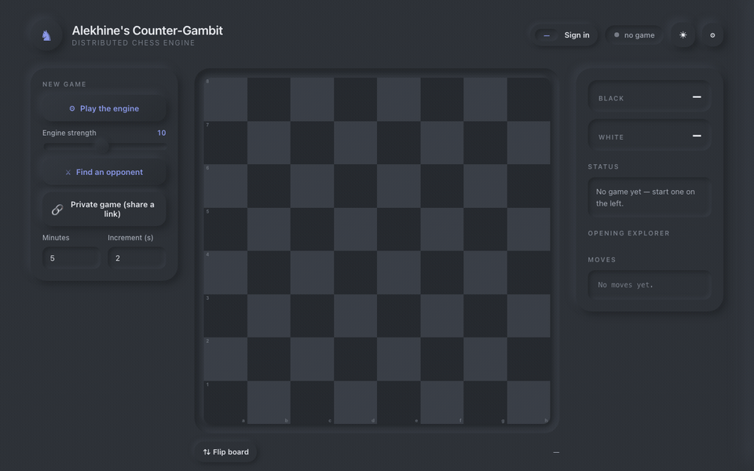
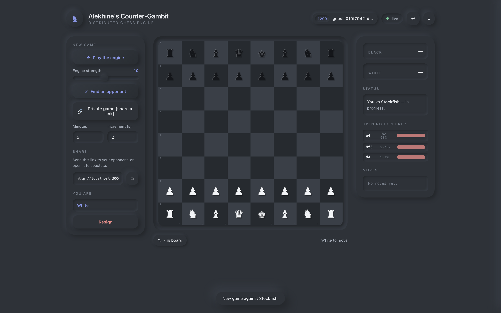
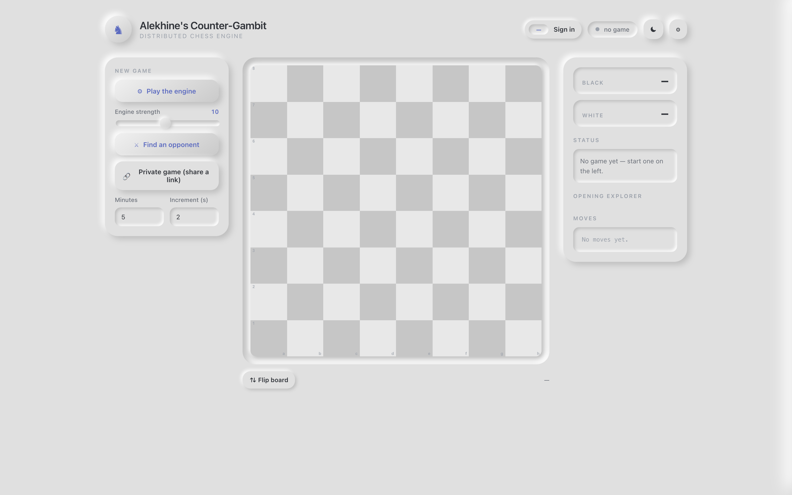
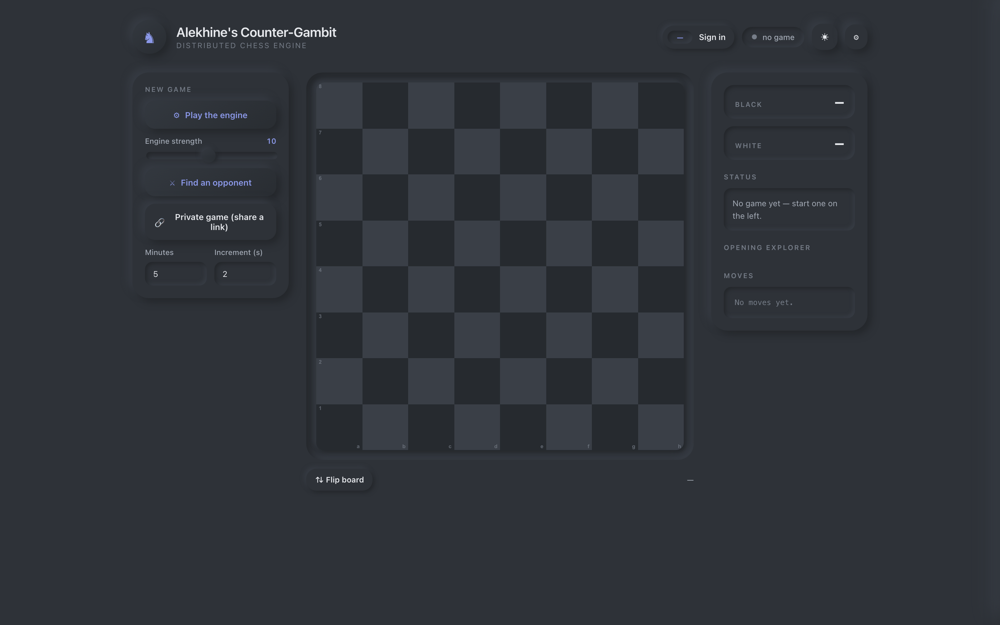
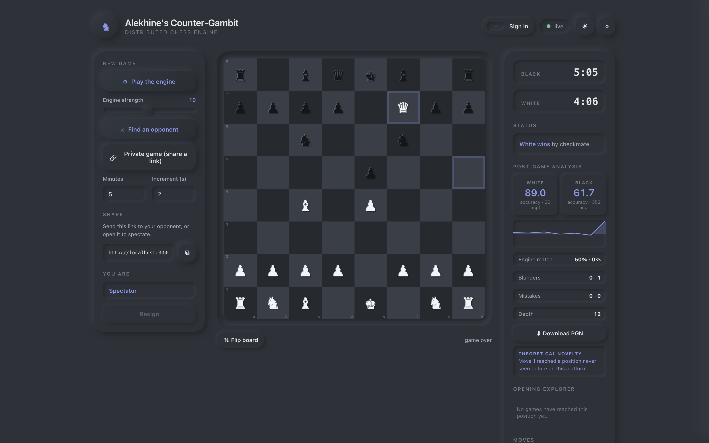
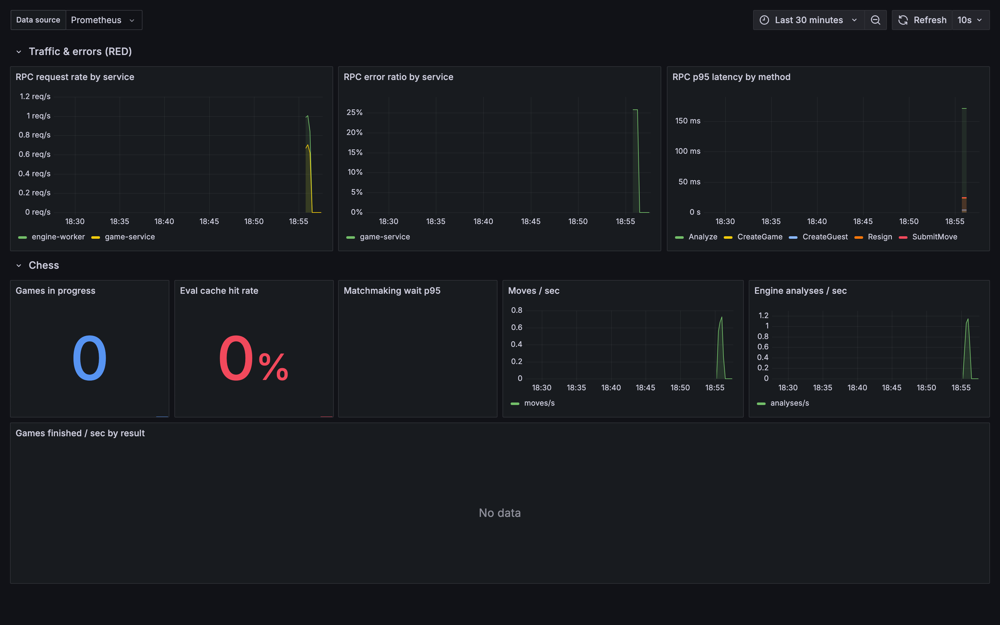
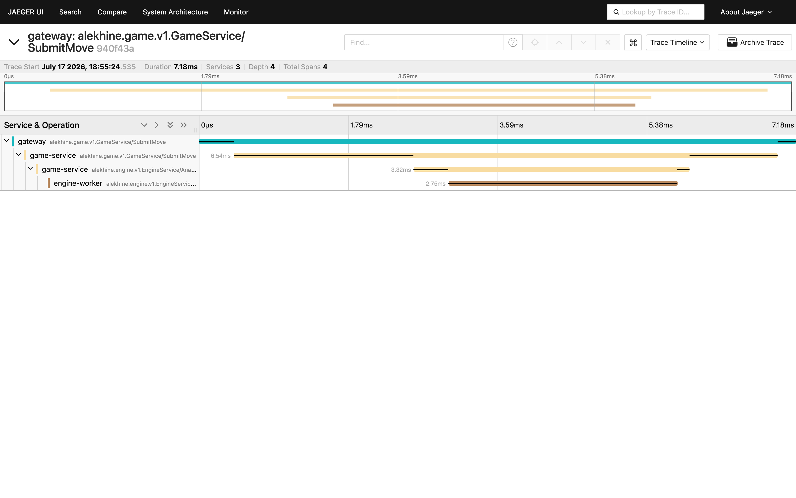
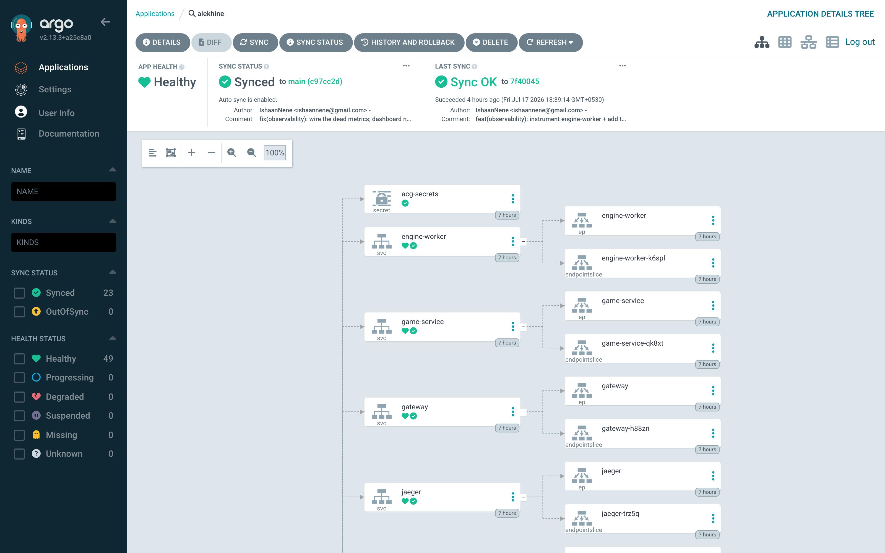
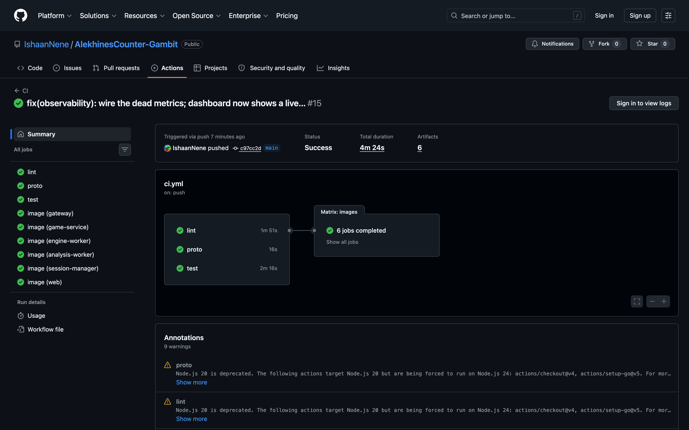

# Alekhine's Counter-Gambit

A distributed chess engine and platform: play chess against Stockfish or other
humans, with moves validated, persisted, streamed live, analyzed asynchronously,
and the whole system running on Kubernetes with full observability.



<sub>Playing Stockfish in the browser, then the platform's Grafana dashboard reacting live to load — games in progress, cache hit rate, and request rate absorbing a spike. (Recording; see [Screenshots](#screenshots) for stills.)</sub>

Built in four quarterly releases — see [ROADMAP.md](ROADMAP.md) for the plan and
[TASKS.md](TASKS.md) for execution-level tasks.

## The problem

Playing chess online looks simple; the platform behind it is a full tour of
distributed-systems engineering. Rules have to be enforced **authoritatively** on
the server (never trust the client). Moves must persist and stream **live** to
both players and any number of spectators. A **compute-heavy engine** has to
analyse positions without blocking play, and finished games need **asynchronous**
post-game analysis. Clocks must never flag-fall a decided game, ratings must
update exactly once, and there should be anti-cheat signals for review — all while
the system stays **available and horizontally scalable**.

Most "build a chess app" projects are a single process with a chess library. This
one is built the way a real product would be: a set of **independently scalable
services** over gRPC and a Kafka event bus, with durable storage, live WebSocket
fanout, full metrics/traces, and a GitOps pipeline onto Kubernetes. Chess is the
vehicle — the point is the **production distributed system around it**, whose
concerns are the same ones behind any real-time, multiplayer, compute-backed
product.

## Screenshots

**In play** — a game against Stockfish, with the live opening explorer and move list:



**Light & dark** — the web client is a dependency-free neumorphic UI, theme-toggled
(it also follows your OS):

<table>
<tr>
<td></td>
<td></td>
</tr>
</table>

**Post-game analysis** — every finished game is analysed asynchronously by a
Kafka-fed worker pool: per-side accuracy, an eval graph, blunder/mistake counts,
engine-match rate, and RedisBloom novelty detection, all served back over GraphQL:



**Observability** — RED + chess-specific metrics in Grafana under sustained load
(games in progress, cache hit rate, matchmaking wait, request rate absorbing a
spike), and a single move request traced across services in Jaeger
(gateway → game-service → engine-worker):





**Platform & delivery** — the whole platform runs on Kubernetes, reconciled from
this repo by ArgoCD (a push to `main` syncs the cluster), and every push is built,
tested, and published to GHCR by GitHub Actions:

<table>
<tr>
<td></td>
<td></td>
</tr>
</table>

## Stack

Go · Erlang/OTP (+ syn clustering) · gRPC + Protocol Buffers · GraphQL ·
WebSockets · PostgreSQL · Redis (+ Streams) · Kafka · MinIO · Stockfish/UCI ·
Docker · Kubernetes · Helm · Terraform · NGINX · ArgoCD · GitHub Actions ·
Prometheus + Grafana · Jaeger + OpenTelemetry · autocannon + k6

## Quickstart

**Local, one command (Docker Compose):**

```bash
make tools     # one-time: install buf, protoc plugins, goose, grpcurl, linter
make up        # all services + Postgres/Redis/Kafka/MinIO + Prometheus/Grafana/Jaeger
               # → app http://localhost:3000, Grafana :3001, Jaeger :16686
make down      # tear it all down
```

**On Kubernetes (the real deployment, on a local kind cluster):**

```bash
cd infra/terraform && terraform apply   # provision the kind cluster (Terraform)
make k8s-deploy                          # build images, load them, helm install
make k8s-ingress                         # install the ingress-nginx controller
                                         # → app http://localhost:8888 (ingress)

# GitOps: let ArgoCD own the deployment from git
make argocd-install && make argocd-app   # push to main → ArgoCD syncs the cluster
```

Run `make help` to see every target.

## Repository layout

```
proto/        protobuf contracts (source of truth) + generated Go stubs
pkg/          shared libraries: chess, engine client, redisx, kafkax, eventlog,
              objstore, openingbook, analysis, telemetry, store
services/     gateway, game-service, engine-worker, analysis-worker, fanout,
              session-manager (clustered Erlang/OTP)
web/          dependency-free neumorphic web client (served by NGINX)
cmd/          small binaries (play CLI)
migrations/   SQL migrations (goose)
infra/        terraform (cluster) · helm (apps) · argocd (GitOps) · k8s (add-ons)
              · observability (Prometheus/Grafana/Jaeger config + dashboard)
load/         autocannon + k6 load tests, and the chaos/resilience suite
docs/adr/     architecture decision records
```

## Status

**Q1 (foundation & vertical slice) — complete.** You can play a full game vs
Stockfish end-to-end through real gRPC services, persisted to Postgres, via
`make up` + `make run-game`. Highlights:

- `pkg/chess` — legal move generation verified by perft (start position to
  depth 4 = 197,281 nodes, plus Kiwipete and endgame positions).
- `engine-worker` — Stockfish driven over UCI behind a gRPC `Analyze` API.
- `game-service` — move validation, Postgres persistence, engine orchestration,
  embedded migrations applied on startup.
- `docker-compose.yml` — one-command local stack; `cmd/play` CLI to play a game.
- CI (GitHub Actions) — build, test (with Postgres + Stockfish), lint, proto drift.

**Q2 (distributed core & real-time) — complete.** The Erlang/OTP session
manager is live and bridged to Go over gRPC:

- `session-manager` (Erlang/OTP) — one supervised `gen_server` per live game
  owning Fischer clocks, turn, presence, and reconnect grace. Crash-isolated:
  killing one game never touches another. Served over gRPC via grpcbox.
- `game-service` ↔ `session-manager` — the Go service provisions a session per
  human-vs-human game, authorizes the side to move, reports each validated move
  (the session applies the clock + increment), and closes the session on
  checkmate/stalemate/draw so a decided game can never flag-fall.
- `gateway` (Go + gqlgen) — public GraphQL API on `:8080/graphql` with a
  playground at `/`. Holds no state: it translates GraphQL into internal gRPC.
  `Game.clock` is a lazy field resolver, so the session-manager is only queried
  when a client actually selects it (and is null for engine games).
- **Live subscriptions** — `subscription { gameUpdated(gameId:) }` over
  WebSocket (`graphql-transport-ws` at `/ws`). Subscribers get the current state
  on connect, then every move pushed with no polling. Fanout is in-process for
  now; T2.7 swaps in Redis so it survives multiple gateway replicas.
- **Web client** (`web/`) — a dependency-free neumorphic UI served by NGINX,
  which also proxies `/graphql` and `/ws` so the browser sees one origin.
  Play Stockfish or share a link and watch the board update live in both tabs.
- **Auth** — three ways in (guest / password / passwordless token), JWT sessions
  in an httpOnly cookie. Identity comes from the session, never the request body.
- **Ratings & history** — Elo with a tiered K-factor, applied idempotently on
  completion; per-user history and a leaderboard.
- **Redis** — cross-replica pub/sub fanout, a FEN+depth evaluation cache
  (355ms → 46ms on a repeat position), and a distributed token-bucket limiter.
- `make up` now runs all seven services: Postgres, Redis, engine-worker,
  session-manager, game-service, gateway, web (**open http://localhost:3000**).

Play a whole game over GraphQL:

```graphql
mutation { createGame(input: { engineDepth: 10 }) { id fen } }
mutation { move(input: { gameId: "<id>", uci: "e2e4" }) { fen moves { ply uci } } }
query    { game(id: "<id>") { status endReason clock { whiteMs blackMs running } } }
```

**Q3 (event-driven data & analysis) — complete.** Finished games flow through
Kafka to a pool of workers and come back as insight:

- **Kafka event backbone** — game-service publishes `analysis-requested` on game
  end (protobuf on the wire); a consumer group of `analysis-worker`s pulls the
  work, so analysis capacity scales by adding replicas, not by touching producers.
- **Async analysis** — each position evaluated once (N+1 calls for N moves),
  yielding centipawn loss, accuracy (win%-domain), and per-move verdicts
  (blunder/mistake/brilliant). Surfaced as an eval graph in the web client.
- **Novelty detection (RedisBloom)** and **fair-play signals (RedisTimeSeries)** —
  the first previously-unseen position in a game is flagged; per-player
  engine-match/accuracy series are recorded for later human review (see ADR-0003).
- **Object storage (MinIO)** — PGN archives and full analysis JSON, downloadable
  via split-horizon presigned URLs. An **opening book** lives here too: engine
  workers load it at startup (seeding on first run) and play weighted-random book
  moves for opening variety — never during analysis, which needs true evals.
- **Opening explorer** — transposition-collapsing statistics over stored games.

**Q4 (production platform) — complete.** The whole architecture runs on
Kubernetes, delivered by GitOps, observed end-to-end:

- **Containerized & orchestrated** — six multi-stage images; a Helm umbrella
  chart templates every service with HPAs, probes, and resource limits. Postgres
  and MinIO are StatefulSets on PVCs; Kafka is a deliberately disposable
  single-node KRaft node (it can't recover its log on restart, so it self-heals
  fresh — Postgres is the source of truth).
- **Terraform** provisions the cluster (kind locally; the EKS/GKE swap point is
  one file). **ingress-nginx** path-routes GraphQL/WebSocket/static on one host.
- **GitOps (ArgoCD)** — the cluster is reconciled from this repo; a push to `main`
  syncs, and manual drift self-heals in ~5s. **CI (GitHub Actions)** lints, checks
  proto drift, tests against real Postgres + Stockfish, and builds + pushes all
  six images to GHCR.
- **Observability** — RED + chess metrics on every Go service (Prometheus),
  an auto-provisioned Grafana dashboard, alerting rules, and distributed traces
  across gateway → game-service → engine-worker (OpenTelemetry → Jaeger).
- **Load & chaos testing** — autocannon + k6 baselines (~18.8k req/s reads, move
  p95 15ms), and a chaos suite (pod kills, rolling restarts, Redis/Postgres
  outages, HPA) that **found and fixed two real dependency-timeout bugs**
  (see [load/chaos/RESULTS.md](load/chaos/RESULTS.md)).

**Beyond Q4 — horizontal scale & no single point of failure.** The scale work
that closes the platform's last gaps, built on one new primitive — a durable,
ordered **per-move event log** (a transactional outbox in Postgres relayed to a
Redis Stream per game, so an event is durable exactly when its move is):

- **The session tier no longer has a single point of failure.** The Erlang
  session-manager — previously one stateful replica — is now a **`syn` cluster**.
  Live games shard across the nodes by **consistent (rendezvous) hashing**, and a
  game whose node dies **re-homes onto a survivor from a Redis checkpoint with its
  clock intact** (only the brief outage is charged to the side on the move). No
  sticky routing. Proven by an automated **two-node** test that halts the owning
  node mid-game and asserts the game survives; reproduce it on the cluster with
  `load/chaos/chaos.sh session-handoff`.
- **A dedicated spectator fanout tier** (`services/fanout`) built for the "one
  popular game, a huge crowd" shape: **one Redis reader per game** fans each move
  out to every watcher over WebSocket as **deltas** (not full snapshots), with
  reconnect-replay from the stream and slow-consumer backpressure. Watch any game
  live in the browser at `/spectate` (see `web/watch.html`); load-test it with
  `load/k6/fanout.js` — 500 spectators on one game are caught up in ~2 ms with
  zero drops (a local floor; it fans out further per replica behind the HPA).

Numbers and the failure experiments are in
[load/chaos/RESULTS.md](load/chaos/RESULTS.md).

See [ROADMAP.md](ROADMAP.md) for the full epic-by-epic status and [docs/adr/](docs/adr/)
for the architecture decisions.
